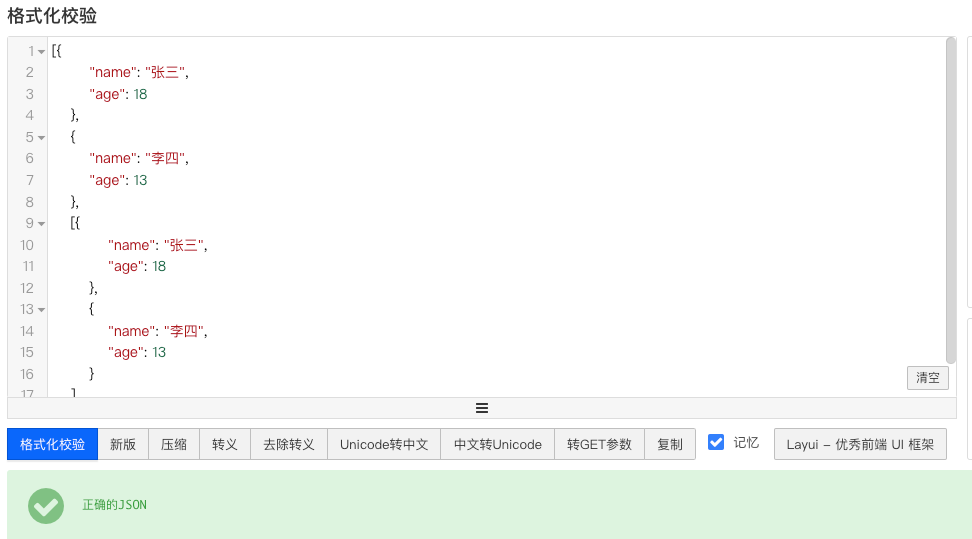

# Ajax网络编程

> 1. 概述
> 2. 原生Ajax
> 3. 同步和异步
> 4. json数据格式
> 5. Axios介绍
> 6. AxiosAPI
> 7. 全局默认配置
> 8. Axios拦截器
> 9. 浏览器跨域

## 概述

在没有Ajax之前的web页面中我们看到的网页都是单机版的没有数据交互刷新能力,可以理解为是单机版网页.

举个Ajax网络请求的例子:

​	在登录页面中,我们往往需要登录账号才能访问对应内容,这里就使用到了Ajax,当用户在表单中填写账号密码验证码登相关信息,点击提交通过Ajax发送网络请求达到后端接口,并返回用户登录是否成功,这就是一次Ajax网络请求.


## 原生Ajax

get请求代码示例:

```html
<!DOCTYPE html>
<html lang="en">
<head>
    <meta charset="UTF-8">
    <meta name="viewport" content="width=device-width, initial-scale=1.0">
    <title>Document</title>
</head>
<body>
    <script>
        // 创建一个Ajax对象
        let xhr = new XMLHttpRequest();
        // 设置请求行
        xhr.open('get', 'http://www.baidu.com');
        // 设置请求头
        xhr.setRequestHeader('Content-Type', 'application/x-www-form-urlencoded');
        // 设置请求体
        xhr.send();
        // 监听请求状态
        xhr.onreadystatechange = function () {
            // 判断请求是否完成
            if (xhr.readyState === 4 && xhr.status === 200) {
                console.log(xhr.responseText);
            }
        }
    </script>
</body>
</html>
```

post请求代码示例:

```html
<!DOCTYPE html>
<html lang="en">
<head>
    <meta charset="UTF-8">
    <meta name="viewport" content="width=device-width, initial-scale=1.0">
    <title>Document</title>
</head>
<body>
    <script>
        // 创建一个Ajax对象
        let xhr = new XMLHttpRequest();
        // 设置post请求
        xhr.open('post', 'http://localhost:3000/api/login');
        // 配置请求头
        xhr.setRequestHeader('Content-Type', 'application/x-www-form-urlencoded');
        //  设置body请求体 发送请求
        let json = JSON.stringify({
            name: 'zhangsan',
            age: 18
        })
        xhr.send(json);
        // 监听请求状态
        xhr.onreadystatechange = function() {
            if (xhr.readyState === 4 && xhr.status === 200) {
                console.log(xhr.responseText);
            }
        }
    </script>
</body>
</html>
```

## 同步和异步

> 同步: 一个人做一件事,中间不能间断要一直等待
>
> 异步: 一个人做一件事,中间不需要自己的时候可以去干别,有结果回来查看结果就好
>
> 同步适用于实时响应结果
>
> 异步适用于时间比较长不着急关心结果做完就行

在上述示例中我们可以看到xhr.open()方法只传了2个参数,还可以再传一个boolean参数,控制是否开启异步请求,默认true异步,如果需要同步执行可以通过传递false实现,如果采用同步执行,则代码会等待请求结果回来后在执行后面内容!

代码示例:

```html
<!DOCTYPE html>
<html lang="en">
<head>
    <meta charset="UTF-8">
    <meta name="viewport" content="width=device-width, initial-scale=1.0">
    <title>Document</title>
</head>
<body>
    <script>
        // 创建一个Ajax对象
        let xhr = new XMLHttpRequest();
        // 设置post请求
        xhr.open('post', 'http://localhost:3000/api/login', true);
        // 设置body请求体
        xhr.setRequestHeader('Content-Type', 'application/x-www-form-urlencoded');
        // 发送请求
        let json = JSON.stringify({
            name: 'zhangsan',
            age: 18
        })
        xhr.send(json);
        // 监听请求状态
        xhr.onreadystatechange = function() {
            if (xhr.readyState === 4 && xhr.status === 200) {
                console.log(xhr.responseText);
            }
        }
    </script>
</body>
</html>
```

## Json数据格式

Json数据格式就是一种网络数据传输格式,方便将面向对象语言中的对象转成字符串后传输.

注意Json传输格式格式化对象后是不包含对象所拥有的方法的,只包含其属性.

代码示例:

```html
<!DOCTYPE html>
<html lang="en">
<head>
    <meta charset="UTF-8">
    <meta name="viewport" content="width=device-width, initial-scale=1.0">
    <title>Document</title>
</head>
<body>
    <script>
        // 定义一个Person类
        function Person(name, age) {
            this.name = name;
            this.age = age;
        }

        /**
         * Person类的json格式
         * {
         *     "name": "张三",
         *    	"age": 18
         * }
         */
    </script>
</body>
</html>
```


### Json文件书写

```json
{} // 大括号是对象
[] // 中括号是数组

// 在对象中都是以k:v形式存在, json 文件最外层可以是[] 也可以是大括号,没个元素结尾如果有下个元素必须跟上逗号
[
  {
    "name": "张三",
    "age": 18
  },
  {
    "name": "李四",
    "age": 13
  },
  [
    {
      "name": "张三",
      "age": 18
    },
    {
      "name": "李四",
      "age": 13
    }
  ]
]
```

上述内容校验结果:



## Axios 介绍

Axios 是目前应用最为广泛的Ajax封装库,官网: axios-js.com

1. 支持node端和浏览器端
2. 支持Promise
3. 丰富的配置项支持拦截等高级配置

Axios 使用方式

1. 通过script 标签引入
2. 通过npm 安装axios导入模块引用


## Axios API

简单方式发送get请求

```html
<!DOCTYPE html>
<html lang="en">
<head>
    <meta charset="UTF-8">
    <meta name="viewport" content="width=device-width, initial-scale=1.0">
    <title>Document</title>
    <script src="https://cdn.jsdelivr.net/npm/axios@1.1.2/dist/axios.min.js"></script>
</head>
<body>
    <script>
        axios.get('http://localhost:8000/api/test')
      	// .then 返回结果回调函数
        .then(function (response) {
            console.log(response);
        })
      	// .catch 返回异常回调函数
        .catch(function (error) {
            console.log(error);
        });
    </script>
</body>
</html>
```

简单方式发送post请求

```html
<!DOCTYPE html>
<html lang="en">
<head>
    <meta charset="UTF-8">
    <meta name="viewport" content="width=device-width, initial-scale=1.0">
    <title>Document</title>
    <script src="https://cdn.jsdelivr.net/npm/axios@1.1.2/dist/axios.min.js"></script>
</head>
<body>
    <script>
        // 使用axios post请求
        axios.post("http://localhost:8080", {
            name: "zhangsan",
            age: 18
        })
      	// .then 返回结果回调函数
        .then(function (response) {
            console.log(response);
        })
      	// .catch 返回异常回调函数
        .catch(function (error) {
            console.log(error);
        });
    </script>
</body>
</html>
```

## Axios 复杂请求

axios 本身也是一个api方法可以通过传参配置复杂的配置项. [中文文档](https://axios-http.com/zh/docs/post_example)

1. axios(config)            // config为对象格式的配置选项
2. axios(url,config)      // config 可选

config 常用配置

> url		用于请求目标服务器的url *
>
> method  请求时使用的方法 *
>
> baseURL 传递相对URL前缀,自动加载url前面
>
> headers  请求头对象
>
> params   url请求参数对象
>
> data    请求体对象
>
> timeout 请求超时时间
>
> responseType 指定服务器相应数据的数据类型,默认'JSON'


## Axios拦截器

请求拦截器, 在发起请求之前调用

响应拦截器,在响应结果处理前调用

```js
// 添加请求拦截器
axios.interceptors.request.use(function (config) {
    // 在发送请求之前做些什么
    return config;
  }, function (error) {
    // 对请求错误做些什么
    return Promise.reject(error);
  });

// 添加响应拦截器
axios.interceptors.response.use(function (response) {
    // 2xx 范围内的状态码都会触发该函数。
    // 对响应数据做点什么
    return response;
  }, function (error) {
    // 超出 2xx 范围的状态码都会触发该函数。
    // 对响应错误做点什么
    return Promise.reject(error);
  });
```

## 跨域

>  同源策略是浏览器的一种安全策略,所谓同源是指域名,协议,端口完全相同
>
> 在同源策略下,只有同源的地址才可以相互通过Ajax的方式请求
>
> 同源或者不同源说的是两个地址之间的关系,不同源地址之间请求我们称呼跨域

### Cors跨域

Gross Origin Resource Share，跨域资源共享这种方案无需客户端作出任何变化(客户端不用改代码)，只是在被请求的服务端响应的时候添加一个 Access-Control-Allow-Origin 的响应头，表示这个资源是否允许指定域请求

```
Access-Control-Allow-Origin:  *
表示允许任意源访问，不安全

http://foo.com
允许指定的源访问
```


