# JavaScript核心

> 详细了解js基本使用
>
> 1. 对象创建
> 2. 构造函数
> 3. 静态成员和实例成员
> 4. 构造函数的问题
> 5. 原型对象
> 6. 原型链
> 7. 原生构造函数的原型对象
> 8. 案例
>    1. 随机方块
> 9. ES6新特性
> 10. VSCode常用插件

## 对象创建

1. new Object() 创建对象

   ```javascript
   // 创建对象,建单创建
   let obj = new Object();
   
   // 给对象赋值
   obj.name = '张三';
   obj.age  = 15;
   obj.hello = function() {
     console.log("hello ,ma name is " + this.name);
   }
   
   console.log(obj);
   ```

   

2. 字面量初始化对象

   ```javascript
   // 通过大括号直接初始化对象
   let obj = {
     "name": '张三',
     "age": 12,
     "hello": function() {
   	  console.log("hello ,ma name is " + this.name);
   	}
   }
   ```

   

3. 工厂函数

   ```javascript
   // 工厂函数创建对象
   function createObj(name,age,helloFunc) {
   	let obje = {
           "name": name,
           "age": age,
           "hello": helloFunc
       }
       return obje;
   }
   
   let obj = createObj("张三","李四",function hello() {
       console.log('hello world');
   })
   
   obj.hello();
   console.log(obj);
   ```

## 构造方法

​	通过构造器创建的对象,可以通过对象的constructor属性找到生成这个对象的构造函数

```JavaScript
// 定义构造器
function Person(username,userage){
    name=username,
    age=userage,
    hello = function hello() {
        console.log(this.name + " hello ");
    }
    return this;
}

// 通过构造函数创造两个对象
let p1 = new Person("bok",13);
let p2 = new Person("heght",10);
console.log(p1);
console.log(p2);
// 调用创建对象的方法
p1.hello();
p2.hello();
```

## 静态和实例属性

​	通过构造函数方法创建对象时,可以给构造函数和创建的实力对象添加属性和方法,这些方法和属性都是实例对象通过this关键字调用私有的这个叫做实例属性,静态属性是指固定在构造器对象上的属性,只有构造器本身可以调用,被创建的实例对象无法调用.

​	总之,通过构造器对象设置的属性属于静态属性,每个模板实例都会用到,通过实例对象

```javascript
let person = function Person(){
	// 静态属性
    person.pname = '用户姓名';
}

// 动态属性
let p1 = new person();
p1.page = 13;

console.log(person.pname);       // 用户姓名
console.log(p1.pname);           // undefined

console.log(person.page);       // 用户姓名
console.log(p1.page);           // undefined

/**
 * 静态属性只能通过构造器对象自身访问,实例无法访问
 * 动态属性只能通过实例对象访问,构造器对象无法访问
 */
```

## 公共属性方法

​	定义公共属性和方法提供给构造器对象使用,避免上述静态和实例属性互相不可见无法在构造器定义一次属性所生产的实例可以全部共用此内容.

```javascript
function Person(name, age) {
  this.name = name;
  this.age = age;
}

// 通过构造器对象的prototype对象共享构造器设定的属性
Person.prototype.gender = "unknown";

var john = new Person("John", 25);
console.log(john.gender); // 输出 "unknown"

var jane = new Person("Jane", 30);
console.log(jane.gender); // 输出 "unknown"

Person.prototype.gender = "male";

console.log(john.gender); // 输出 "male"
console.log(jane.gender); // 输出 "male"
```

## 原型对象

​	每一个构造器函数都有自己的原型对象,this.prototype就是当前构造器函数的原型对象,this.prototype.constructor指向自己当前的构造函数

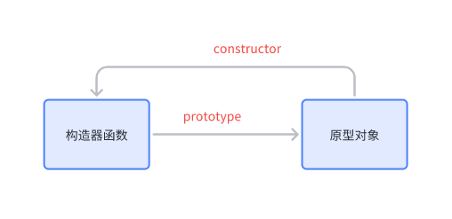

​	每一个构造器创造的实例都存在`__proto__`属性,`__proto__`属性指向了构造器函数指向的原型对象.

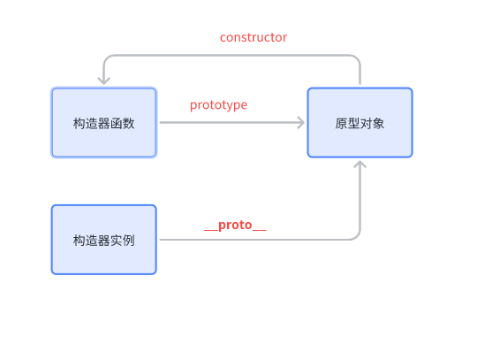

​	通过上图我们能发现他们之间的关系,实例可以通过`__proto__`找到原型对象在通过原型对象`constructor`找到创建自己的构造器函数.

​	总结:JavaScript 规定，每一个造函数都有一个 prototype 属性，指向构造函数的原型对象.这个原型对象的所有属性和方法，都会被构造函数的实例对象所拥有。因此，我们可以把所有对象实例需要共享的属性和方法直接定义在 prototype 对象上。解决了内存浪费问题可以把同一构造器对象实例的公共方法定义在prototype对象上,这样就可以被所有该构造器对象实例所访问


## 原型链

​	当访问一个实例对象的属性,当前实例中并没有包含该属性就会到`__proto__`原型对象上面找,原型对象找上如果找不到,会继续到原型对象的原型对象上找.

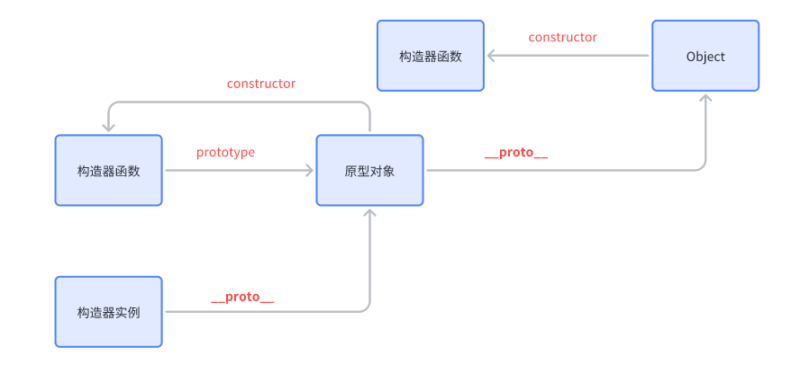

代码示例

```JavaScript
function Person(){
    this.name = 'person';
    this.age  = 15
}
// 向Person的原型对象上的原型对象添加属性type
Person.prototype.__proto__.type = 'test'

let p = new Person();

console.log(p.__proto__)
console.log(p.__proto__.__proto__)

// 通过p实例访问type看下是否能拿到
console.log(p.type)
```

图片结果:

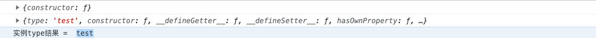


​	通过上述示例可以看到我们在p实例中直接就可以访问顶级原型对象上的属性.


## 原生构造函数的原型对象

​	在JavaScript中默认原生提供的构造器对象指向的原型对象提供了大量方法,假设此时我们对原生构造函数的原型对象上的方法不满意需要对其进行重写覆盖该如何操作?

​	先查看几个原生构造对象的原型对象所携带的方法.

​	代码示例:

```JavaScript
console.log(Object.prototype);
console.log(String.prototype);
console.log(Number.prototype);
```

图片结果:

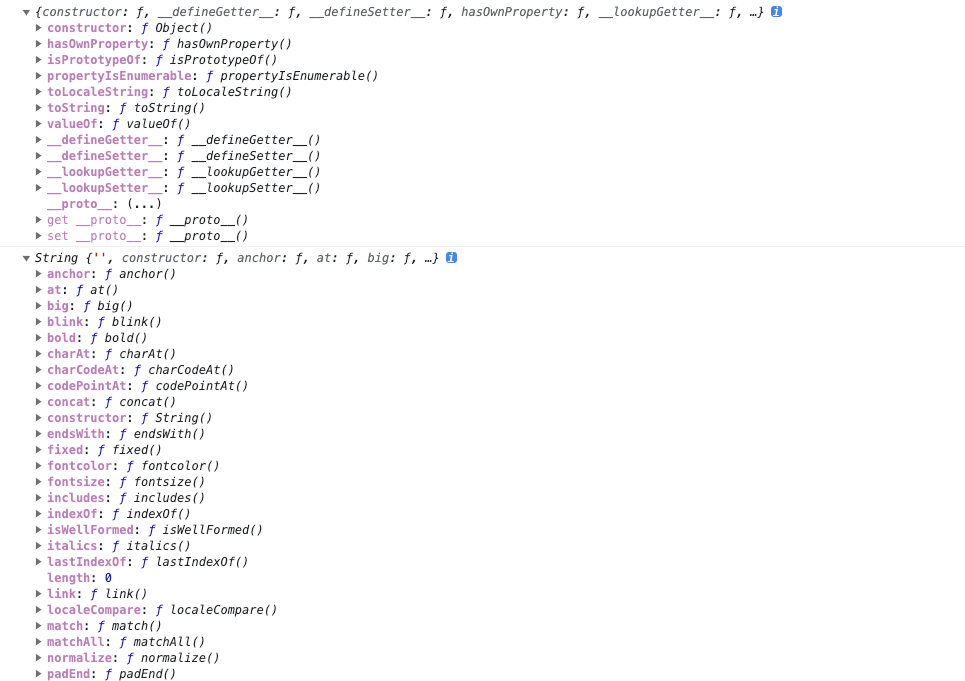

​	重写Object构造函数原型对象上的toString

```JavaScript
// 输出默认Object原型对象上的toString() 方法
console.log(Object.prototype.toString());

// 重写覆盖toString方法
Object.prototype.toString = function(){
    return "this toString function";
}
// 输出默认Object原型对象上的toString() 方法
console.log("重写后的toString: " ,Object.prototype.toString());

```

图片结果:

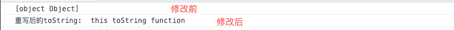

总结: 其本质就是不满意原生默认方法可以根据自身需求更改和重写功能.

## 随机方块

```html
<!DOCTYPE html>
<html lang="en">
<head>
    <meta charset="UTF-8">
    <meta name="viewport" content="width=device-width, initial-scale=1.0">
  <title>Document</title>
    <style>
        body{list-style: none; margin: 0; padding: 0;}
        .box {
            width: 100%;
            background-color: lightgray;
            position: relative;
        }
    </style>
</head>
<body>
    <div class="box">

    </div>
    <script>

        // 编写岁数颜色工具类
        let RandRGBColor =  {
            red: 0,
            blue: 0,
            green: 0,

            randColor(){
                this.red = Math.floor(Math.random() * 256);
                this.blue = Math.floor(Math.random() * 256);
                this.green = Math.floor(Math.random() * 256);
                return "rgb(" + this.red + "," + this.green + "," + this.blue + ")";
            },
            
            randNumber(num) {
            return Math.floor(Math.random() * num);
            }

        }

        let box =  document.querySelector('body .box');
        box.style.height = window.innerHeight + 'px';
        function randBlock(box) {
            for (let index = 0; index < 10; index++) {
                // 创建子元素
                let childDiv = document.createElement("div");
                // 设置子元素的样式和内容
                childDiv.style.backgroundColor = RandRGBColor.randColor();
                childDiv.style.width = "10px";
                childDiv.style.height = "10px";
                childDiv.style.position = "absolute";
                let x = RandRGBColor.randNumber(window.innerWidth-10);
                let y = RandRGBColor.randNumber(window.innerHeight-10);
                childDiv.style.left = x + "px";
                childDiv.style.top = y + "px";
                box.appendChild(childDiv);
            }
        }
        
        // 删除父元素当前所有子节点元素
        function removeChildNodes(parentNode) {
            // 不断循环，直到 parentNode 没有子节点
            while (parentNode.firstChild) {
                // 删除子节点
                parentNode.removeChild(parentNode.firstChild);
            }
        }

       // 开启定时任务每秒执行一次
        setInterval(() => {
            removeChildNodes(box)
            randBlock(box) 
        }, 1000);
        
    </script>
</body>
</html>
```


## ECMAScript概述

ECMAScript 是前端开发语言定义的一套规范,其主要提供了一套基础标准的语法规范,JavaScript就是在ECMAScript之上进行扩展!


## VSCode常用插件

```
1. open in browser
	打开浏览器插件
2. live server
	本地启动静态服务器,并打开html页面,当文件进行修改后会自动刷新浏览器内容
3. vetur
	快速生成vue基本模板插件
```

## 作用域

ECMAScript之前我们的js只有两种作用于

1.  全局作用域
2. 函数作用域

ECMAScript2015之后新增了块级作用域

> 通过 let 关键字在函数内定义变量是可以的

## 常亮

ECMAScript2015之后新增了常亮定义关键字

> 通过 const 关键字定义常量,该内容第一次定义赋值完成后后续无法对该变量进行修改其值

## 数组解构

```html
<!DOCTYPE html>
<html lang="en">
<head>
    <meta charset="UTF-8">
    <meta name="viewport" content="width=device-width, initial-scale=1.0">
    <title>Document</title>
</head>
<body>
    <script>
        // 数组解构
        const arr = [1,2,3,4]
        // 解构
        const [a,b,c,d] = arr;
        console.log(a,b,c,d);
    </script>
</body>
</html>
```

## 对象解构

```html
<!DOCTYPE html>
<html lang="en">
<head>
    <meta charset="UTF-8">
    <meta name="viewport" content="width=device-width, initial-scale=1.0">
    <title>Document</title>
</head>
<body>
    <script>
        // 对象解构
        const obj = {
            name: '张三',
            age: '13'
        }

        // 解构
        const {name,age} = obj;
        console.log(name,age);
        
    </script>
</body>
</html>
```

## 模板字符串

模板字符串相较于传统字符串保留了字符串本身的换行,并且我们可以通过${} 插值表达式将变量插入到字符串中

```html
<!DOCTYPE html>
<html lang="en">
<head>
    <meta charset="UTF-8">
    <meta name="viewport" content="width=device-width, initial-scale=1.0">
    <title>Document</title>
</head>
<body>
    <script>
        // 模板字符串
        const name = '张三';
        const str = `这是一个人名


        我叫 ${name}`
        console.log(str);
    </script>
</body>
</html>
```

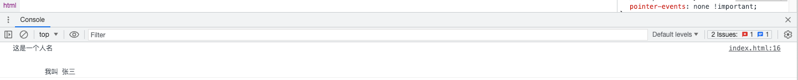

从上述控制台图片中可以看出我们的字符串的确保留了换行,并且将变量name 插入到了字符串中去

## 字符串扩展方法

> 1. includes			// 包含
> 2. startsWith        // 以什么开始
> 3. endsWith         // 以什么结束

代码示例:

```html
<!DOCTYPE html>
<html lang="en">
<head>
    <meta charset="UTF-8">
    <meta name="viewport" content="width=device-width, initial-scale=1.0">
    <title>Document</title>
</head>
<body>
    <script>
        const str = 'hello world';
        // 包含
        console.log(str.includes('hello'));

        // 以he开头
        console.log(str.startsWith('he'));

        // 以a结尾
        console.log(str.endsWith('a'));
    </script>
</body>
</html>
```

图片结果:

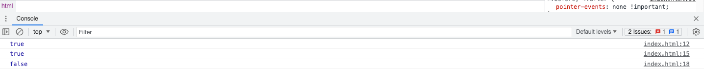

## 函数参数默认值

代码示例:

```html
<!DOCTYPE html>
<html lang="en">
<head>
    <meta charset="UTF-8">
    <meta name="viewport" content="width=device-width, initial-scale=1.0">
    <title>Document</title>
</head>
<body>
    <script>
        function test(enable = true){
            if(enable){
                console.log('使用默认true');
            } else {
                console.log('使用传参false');
            }
        }

        test();             // 使用默认true
        test(false);        // 使用传参false
    </script>
</body>
</html>
```


图片结果:

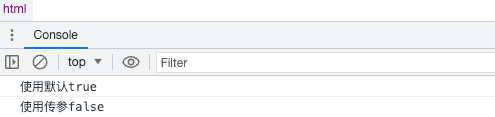

## 函数不定长传参

当方法中不确定接收多个参数时,我们可以通过给你形参名前加`...`用来表示当前形参以数组形式接收多个参数,注意当有不定长传参时,所有单个形参都要放在不定长形参的前面.

另外可以采用arguments关键字,会自动接收"所有"传参

代码示例:

```html
<!DOCTYPE html>
<html lang="en">
<head>
    <meta charset="UTF-8">
    <meta name="viewport" content="width=device-width, initial-scale=1.0">
    <title>Document</title>
</head>
<body>
    <script>
        function test(name = 'default',...noLength){
            // noLength 是一个不定长参数,可以接收多个参数
            console.log('name = ',name);
            console.log('noLength = ',noLength);
        }
        test('test',1,2,3,4,5,6,7,8,9,0);
      
      function test() {
            console.log(arguments);
        }

        test(1, 2, 3); 
    </script>
</body>
</html>
```


图片结果:

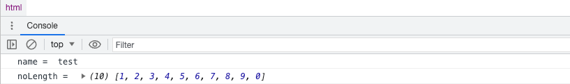

反向解析不定长参数

代码示例:

```html
<!DOCTYPE html>
<html lang="en">
<head>
    <meta charset="UTF-8">
    <meta name="viewport" content="width=device-width, initial-scale=1.0">
    <title>Document</title>
</head>
<body>
    <script>
        function test(...noLength){
            console.log(...noLength);
        }
        test(1,2,3,4,5,6,7,8,9,0);
    </script>
</body>
</html>
```

图片结果:


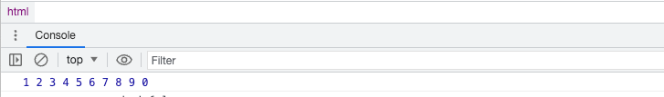

## 箭头函数

ES6新语法特性,在对象方法中调用this,this指向的是当前对象实例,箭头函数除与传统函数定义不同,主要简化定义繁琐.

代码示例:

```html
<!DOCTYPE html>
<html lang="en">
<head>
    <meta charset="UTF-8">
    <meta name="viewport" content="width=device-width, initial-scale=1.0">
    <title>Document</title>
</head>
<body>
    <script>
        let p = {
            "name": '张三',
            func : () => {
                // 此处调用this 指向的并非是p 
                console.log(this);
            },
            func2 : function() {
                // 此处调用this 指向的是p 
                console.log(this);
            }
        };
        p.func()
        p.func2()
        
    </script>
</body>
</html>
```


图片结果:

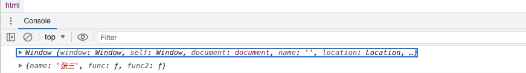

## 对象属性复制

Object.assign方法用于将源对象中的属性赋值到一个目标对象中

代码示例:

```html
<!DOCTYPE html>
<html lang="en">
<head>
    <meta charset="UTF-8">
    <meta name="viewport" content="width=device-width, initial-scale=1.0">
    <title>Document</title>
</head>
<body>
    <script>
        const obj1 = {
            name: 'Lee',
            sayHi() {
                console.log(`Hi ${this.name}`);
            }
        }

        const obj2 = {
            name: 'Kim'
        }

        // 将bj1的属性和方法复制到obj2
        Object.assign(obj2, obj1);

        console.log(obj2);
</script>
</body>
</html>
```

图片结果:

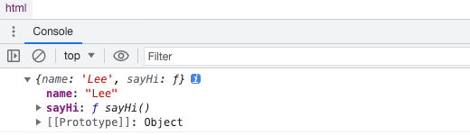

## 判断对象相等

JavaScript中我们判断两个对象是否相等可以使用 `===` 这里为什么没有推荐使用`==` 因为`==` 在判断之前会先将类型进行转换,如果类型转换出错就会抛出异常,而`===`则是先判断类型如果类型不相等则直接返回false 不会有异常的出现.

## Class类关键字

ECMAScript 6 之后出现了可以通过`class` 关键字定义类的类型

代码示例:

```html
<!DOCTYPE html>
<html lang="en">
<head>
    <meta charset="UTF-8">
    <meta name="viewport" content="width=device-width, initial-scale=1.0">
    <title>Document</title>
</head>
<body>
    <script>
        // es6之前定义对象的方法
        class Person extends Object {
            constructor(name, age) {
                super(name,age);
                this.name = name;
                this.age = age;
            }
        }
        const p = new Person('张三', 18);

        // es6之后定义对象的方法
        class Student extends Person {
            // 构造器当new Person时候会自动执行此方法
            constructor(name, age) {
                super(name,age);
                this.name = name;
                this.age = age;
                console.log('构造器');
            }
            say() {
                console.log('构造器');
            }
        }
        let stu = new Student('张三', 18);
        console.log(stu.__proto__.__proto__.__proto__);
        console.log(p.__proto__);
        console.log(Student.prototype);
    </script>
</body>
</html>
```

## 静态属性和方法

class 类中定义属性和方法,可以通过是否添加static关键字判断静态或是实例的属性和方法.

静态属性和方法只能通过类去调用

非静态属性和方法可以通过实例调用

代码示例:

```html
<!DOCTYPE html>
<html lang="en">
<head>
    <meta charset="UTF-8">
    <meta name="viewport" content="width=device-width, initial-scale=1.0">
    <title>Document</title>
</head>
<body>
    <script>
        class Person{
            static name = "张三";
            age = 13;
        }
        
        console.log(Person.name);
        console.log(new Person().age);
        console.log(new Person().name);
    </script>
</body>
</html>
```

