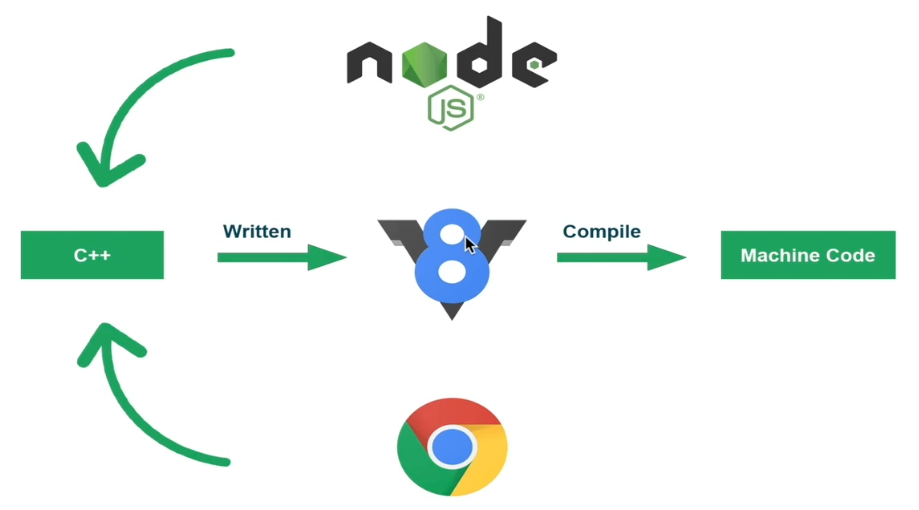

# Node.js

> 1. Nodejs概述

## Nodejs概述

Node.js 是一个JavaScript运行环境

浏览器中运行的 JavaScript 和 Node.js 中运行的 JavaScript 有区别吗.

在内置了 JavaScript V8 Engine 以后实际上只能执行 ECMAScript，就是语言中的语法部分。浏览器为了能够让 JavaScript 操作浏览器窗口以及 HTML 文档，所以在 JavaScript v8 Engine 中添加了控制它们的 AP1,就是 DOM 和BOM.所以 JavaScript 在浏览器中运行时是可以控制浏览器窗口对象和DOM文档对象的。和浏览器不同，在 Node,s 中是没有 DOM 和 DOM 的，所以在 Node.s 中不能执行和它们相关的代码，比如 window.alert) 或者document.cetElementByld0.DOM 和 DOM 是浏览器环境中特有的。在 Node.s 中，作者向其中添加了很多系统级别的 AP1，比如对操作系统中的文件和文件夹进行操作。获取操作系统信息，比如系统内存总量是多少，系统临时目录在哪，对系统的进程进行操作等等。

